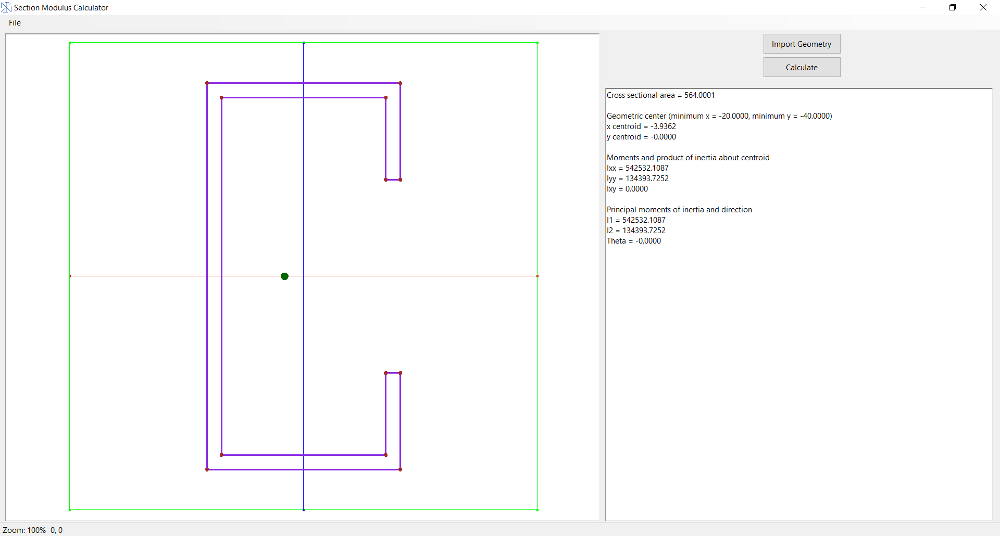
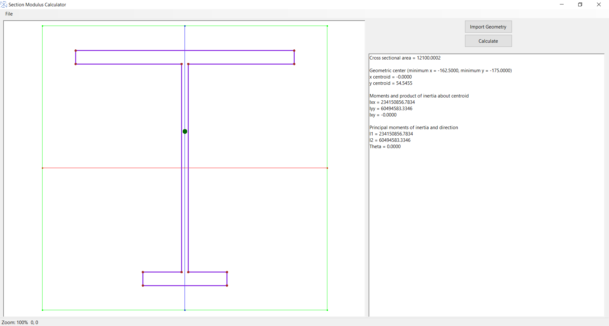
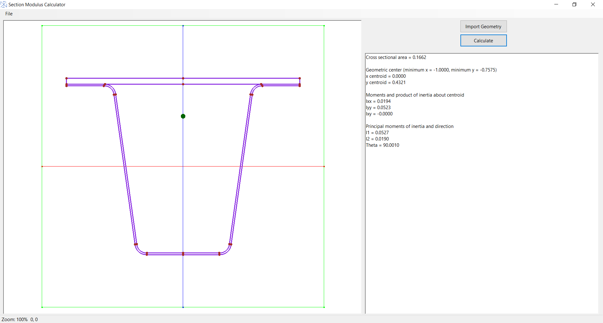

# Section Modulus Calculator

Simple program to calculate the geometric properties of surface (imported from Varai2D program, see https://github.com/Samson-Mano/Draw2D_geometry). Calculates cross-sectional area, centroid, second moment of area at centroid, prinicipal moment of inertia. The program uses modern openGL to display the surface. Most of the coding is to streamline the display of the surface using modern openGL. 

use Ctrl + F for Zoom to fit, Press ctrl + right click for pan operation, Press ctrl + scroll to zoom in/ out   

  

# Status: Completed

# How to use:
Use Draw2D_geometry to create a surface. Export the surface as Raw text export (*.txt). Import the geometry to the program and calculate the section properties.  

Important note: Only surface export can be imported to this program. Check the example surfaces text format.  

  

  
